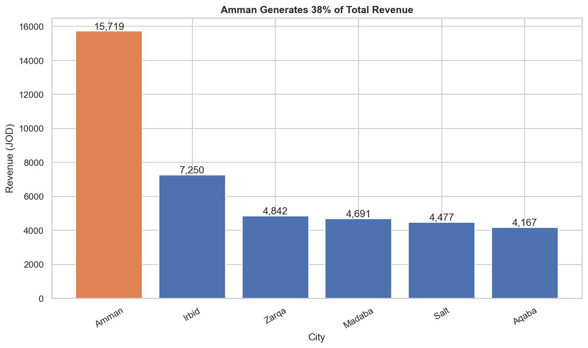
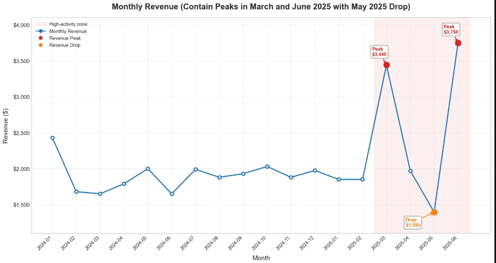

# My KPI and Chart

I chose my KPI, which is city-by-city revenue, to understand which websites have the highest revenue in the Amman digital market. Frankly, this is important because it reveals where business activity is strongest and where growth opportunities lie. I used a bar chart because it facilitates comparison between different cities, and what I see immediately shows that Amman is leading by a significant margin.

# Partner’s KPI and Chart

My partner, Ibrahim Yassin, chose monthly revenue KPIs because they focus on how performance changes over time, which is useful for monitoring trends such as growth and sudden drops in revenue. He used a line chart to display these changes over the months, making it clear that revenue peaked in March and June and declined in May.

# Where We Agreed

Ibrahim and I agreed that the Oman Digital Market is generally performing well. My chart shows that Oman contributes significantly to revenue, while my partner's chart shows relatively stable revenue with some strong months. Looking at both charts together, it becomes clear that the market is supported by strategic locations and consistent activity over time, giving us a more comprehensive picture than relying on a single KPI.

# Where We Disagreed

Ibrahim and I differed on priorities. I focused on location, believing that knowing the revenue stream was more important for revenue generation, while Ibrahim focused on timing, believing that understanding when revenue changes were more beneficial. For this reason, we each chose a different type of chart. I needed to compare categories, while Ibrahim wanted to show trends. These differences stem from our differing perspectives on the key factors influencing performance.

# What I Learned

Through this discussion, I realized that my analysis lacked a temporal dimension because limiting myself to studying the cities I worked on did not show how performance changes over time. To improve my work, I will combine the two ideas and try to analyze revenues by city over different months.
